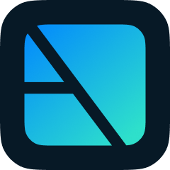

 
 <h1>Assembl</h1>
 

  <b>Assemble, organize, and maximize all screen windows with one keyboard shortcut.</b>
 

  

## Features

- Grid, resize, and rearrange all windows on a screen automatically with one keyboard shorcut
- Maximize window sizes on the screen using all available screen real estate
- Gather and organize visible windows from multiple monitors _(Coming soon)_

## Download Assembl

### 🚀 [Download Assembl for macOS](https://github.com/rossmoody/Assembl/raw/main/Release/Assembl.dmg)

Requires macOS v12.0 or later.

## FAQ

### Isn't Assembl just like [Rectangle](https://rectangleapp.com/) and [Magnet](https://magnet.crowdcafe.com) but without as much functionality?

Yes, no question. Rectangle and Magnet contain more functionality and customization options. Plus, I made this app almost entirely by dissecting the [open-source code from the Rectangle repository](https://github.com/rxhanson/Rectangle) to learn Swift (I usually write Typescript). So, it's mostly the same app with less functionality. _(Thank you, Rectangle folks, I learned so much)_.

I wanted an app where I press one key and have all my windows organized. So, this app could be for you if you want that one thing.

### Does this mean you won't be adding new functionality?

I personally found it tedious to organize my windows one at a time the way Rectangle and Magnet do. Plus, I could never remember the keyboard shortcuts. Assembl intentionally strips all that.

So, the only improvements I will consider would be ones that improve the experience of organizing all windows at once, with one keyboard shortcut, to one screen.

This may include:

- Gather all windows from all screens instead of just the screen the mouse is on
- Reset all the windows to their previous positions and sizes
- Ignore selected screens from being queried
- Tiling screens like folder tabs vs gridding them like stacked boxes

### Why isn't Assembl on the App Store?

Assembl, Magnet, and Rectangle all resize windows using the [Accessibility API](https://developer.apple.com/documentation/objectivec/nsobject/uiaccessibility). It's a fairly hacky approach that developers have been doing since before 2010, but Apple doesn't provide any other way to manage windows. Since 2012, [Apple no longer allows the Accessibility API](https://developer.apple.com/library/archive/documentation/Security/Conceptual/AppSandboxDesignGuide/DesigningYourSandbox/DesigningYourSandbox.html) for apps in the App Store because they must be sandboxed.

This is why Rectangle isn't in the App Store, as well. Magnet was approved by Apple before the change in 2012 and therefore gets to be the only window manager app in the App Store with no possibility for competition in perpetuity.

### My windows aren't perfectly gridded, what gives?

Assembl has to compete with quite a lot of variables when organizing windows. The two largest issues are:

1. Non-resizable windows
2. Windows with large minimum heights or widths

What Assembl does under the hood is try to make the window the correct size to fit perfectly with other windows in a grid. If Assembl can't resize the window to the intended size, the window gets put in the same position on the screen as if it is that size and allows it to overlap with other windows.

In testing, overlapping windows felt like the best user experiences while still allowing access to the toolbars vs sacrificing other window sizes to accommodate for windows with large minimum widths/heights (or in cases where the window can't resize at all).

## Built with

- [KeyboardShortcuts](https://github.com/sindresorhus/KeyboardShortcuts) - Add user-customizable global keyboard shortcuts to your macOS app
- [LaunchAtLogin](https://github.com/sindresorhus/LaunchAtLogin) - Add “Launch at Login” functionality to your macOS app in seconds
- [SwiftUIWindow](https://github.com/mortenjust/SwiftUIWindow) - Open a new macOS (10.12+) window with SwiftUI contents.

## Links

I like making things. Check out what I'm up to lately:

- [More apps by me](https://rossmoody.com)
